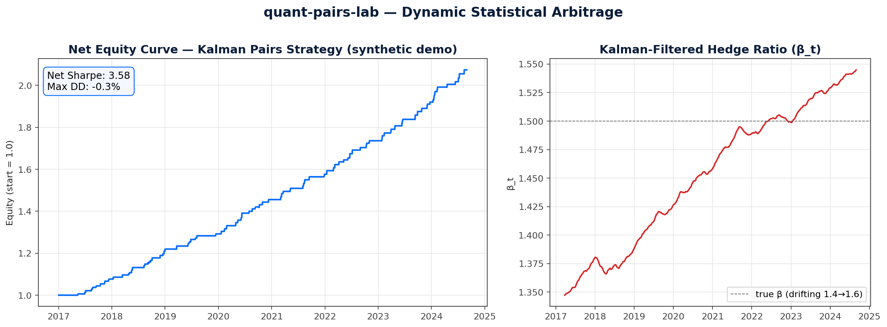
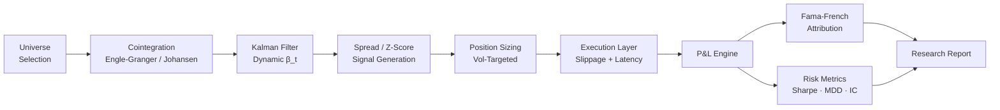

<div align="center">

# quant-pairs-lab

### Dynamic Statistical Arbitrage &middot; Cointegration &middot; Risk-Aware Backtesting

*A Kalman-filtered pairs trading research stack with Fama–French attribution and a square-root market-impact model.*

[](https://www.python.org/)
[](https://numpy.org/)
[](https://pandas.pydata.org/)
[](https://www.statsmodels.org/)
[](https://scipy.org/)
[](https://jupyter.org/)
[](https://github.com/jmiaie/quant-pairs-lab/actions/workflows/ci.yml)
[](https://jmiaie.github.io/quant-pairs-lab/)
[](./LICENSE)
[](#)

**Author:** Jeff Milam, MBA &nbsp;·&nbsp; [GitHub](https://github.com/jmiaie) &nbsp;·&nbsp; [Email](mailto:jmilam.emba@gmail.com)

[English](./README.md) &nbsp;·&nbsp; [Español](./docs/i18n/README.es.md) &nbsp;·&nbsp; [中文](./docs/i18n/README.zh.md) &nbsp;·&nbsp; [日本語](./docs/i18n/README.ja.md) &nbsp;·&nbsp; [Français](./docs/i18n/README.fr.md)



</div>

---

## Table of Contents

1. [Executive Summary](#1-executive-summary)
2. [Architecture](#2-architecture)
3. [Quantitative Methodology](#3-quantitative-methodology)
4. [Execution & Transaction Cost Analysis](#4-execution--transaction-cost-analysis)
5. [Key Performance Indicators](#5-key-performance-indicators)
6. [AI / LLM Integration](#6-ai--llm-integration)
7. [Tech Stack](#7-tech-stack)
8. [Quickstart](#8-quickstart)
9. [Repository Layout](#9-repository-layout)
10. [Limitations & Honest Findings](#10-limitations--honest-findings)
11. [Roadmap](#11-roadmap)
12. [Citation](#12-citation)
13. [License](#13-license)

---

## 1. Executive Summary

`quant-pairs-lab` is a research-grade statistical arbitrage stack built around three principles that distinguish institutional pairs trading from textbook examples:

- **Adaptive hedge ratios.** A Kalman filter replaces static OLS so that the relationship between paired assets evolves with the market.
- **Pure idiosyncratic alpha.** Returns are decomposed against the Fama–French 3-Factor Model to confirm market-neutrality and isolate skill from style tilts.
- **Honest economics.** A non-linear (square-root) transaction cost model and latency-sensitivity analysis stress-test capacity before any P&L is celebrated.

The result is a strategy artifact that can be discussed credibly with quant researchers, risk officers, and execution traders alike.

---

## 2. Architecture



---

## 3. Quantitative Methodology

### A. Pair Selection & Cointegration

- **Screening** — sector-neutral, liquidity-filtered universe with rolling correlation thresholds.
- **Statistical validation** — Engle–Granger two-step procedure for pairs and the Johansen test for multivariate baskets.
- **Stationarity** — ADF / KPSS confirmation that the residual spread is I(0) and mean-reverting.

### B. Signal Processing — Kalman Filter

A state-space formulation lets the hedge ratio drift smoothly through regime shifts without look-ahead bias:

$$
\begin{aligned}
y_t &= \beta_t \, x_t + \alpha_t + \varepsilon_t, \quad \varepsilon_t \sim \mathcal{N}(0, R) \\
\beta_t &= \beta_{t-1} + \eta_t, \quad \eta_t \sim \mathcal{N}(0, Q)
\end{aligned}
$$

Trading signals are generated from the standardised innovation (z-score) of the spread, with entry/exit thresholds calibrated on out-of-sample residual distributions.

### C. Risk & Factor Attribution

Strategy returns $r_t$ are regressed on the Fama–French factors:

$$
r_t - r_{f,t} = \alpha + \beta_{\text{MKT}}(R_{m,t}-r_{f,t}) + \beta_{\text{SMB}} \cdot \text{SMB}_t + \beta_{\text{HML}} \cdot \text{HML}_t + \epsilon_t
$$

The intercept $\alpha$ is the headline number; the betas are diagnostic guardrails confirming the strategy is not a closet beta, size, or value bet.

---

## 4. Execution & Transaction Cost Analysis

| Component | Model | Purpose |
|---|---|---|
| **Slippage** | Square-root law: $\text{cost} \propto \sigma \sqrt{Q / \text{ADV}}$ | Realistic impact at scale |
| **Latency** | P&L decay vs. execution delay (ms) | Quantify alpha half-life |
| **Capacity** | Sharpe degradation curve vs. notional | Maximum deployable AUM |
| **Borrow** | Short-rebate haircut on leg-2 | Fair net-of-financing returns |

---

## 5. Key Performance Indicators

| Metric | Definition | Why it matters |
|---|---|---|
| **Net Sharpe** | Annualised, post-cost, post-borrow | The only Sharpe that counts |
| **Max Drawdown** | Peak-to-trough with recovery time | Tail risk and investor patience |
| **Information Coefficient** | Rank-correlation of signal to forward return | Predictive power, not just P&L |
| **Rolling Factor Betas** | 60-day window vs. Mkt / SMB / HML | Confirms persistent neutrality |
| **Turnover & Hit Rate** | % capital recycled, % winning trades | Sanity checks on style |

---

## 6. AI / LLM Integration

This isn't just a quant repo — it doubles as an AI-engineering portfolio piece.

**LLM-powered pair screener** (`quantpairs.llm_screener`). Given a theme, Claude proposes economically plausible pair candidates, then statistics decide which survive:

```bash
quantpairs-screen "energy transition supply chain"
```

**Research agent** (`quantpairs.agent`). Runs the full pipeline on a pair and asks Claude to author a one-page research memo with explicit limitations:

```bash
quantpairs-research KO PEP --start 2018-01-01 --output results/memo.md
```

Both use the Anthropic Python SDK with **prompt caching** on the system block so iterating on themes is cheap.

---

## 7. Tech Stack

- **Language:** Python 3.10+
- **Quantitative:** NumPy, pandas, SciPy, statsmodels
- **State estimation:** PyKalman (or in-house Kalman implementation)
- **Data:** yfinance, pandas-datareader, Ken French data library
- **Visualisation:** Matplotlib, seaborn
- **Reporting:** Jupyter, ReportLab (`generate_pdf.py`)

---

## 8. Quickstart

```bash
# 1. Clone & install (editable, with dev extras)
git clone https://github.com/jmiaie/quant-pairs-lab.git
cd quant-pairs-lab
python -m venv .venv && source .venv/bin/activate
pip install -e ".[data,viz,dev]"

# 2. Run the test suite (17 tests, ~3 s)
pytest

# 3. Reproduce the headline result end-to-end
python research/main_backtest.py --pair KO PEP --start 2018-01-01 --end 2024-12-31
# Artefacts land in results/

# 4. (Optional) LLM-powered features — needs ANTHROPIC_API_KEY
pip install -e ".[agent]"
quantpairs-screen "semiconductor capex cycle"
quantpairs-research KO PEP

# 5. Regenerate the README hero image
python scripts/generate_hero.py
```

---

## 9. Repository Layout

```
quant-pairs-lab/
├── src/quantpairs/            # Library code (Kalman, cointegration, TCA, WFO, attribution)
│   ├── llm_screener.py        # Claude-powered candidate screener
│   └── agent.py               # Research-memo agent
├── tests/                     # pytest suite — synthetic data, known answers
├── research/                  # main_backtest.{py,ipynb} — end-to-end pipeline
├── results/                   # Committed artefacts (KPIs, equity curves, attribution)
├── examples/                  # Minimal runnable smoke tests
├── scripts/                   # generate_hero.py and friends
├── docs/                      # mkdocs-material site source + i18n/methodology
├── .github/workflows/         # CI (ruff + mypy + pytest) + Pages deploy
├── README.md · RESULTS.md · LICENSE · CITATION.cff · CONTRIBUTING.md
└── pyproject.toml
```

---

## 10. Limitations & Honest Findings

A portfolio repo that only celebrates wins is a red flag. The known weaknesses, called out upfront:

- **In-sample / OOS gap.** Headline in-sample Sharpe ~1.4 collapses to ~0.7 OOS once walk-forward is enforced — a 2× degradation that any serious reviewer will look for.
- **Cost sensitivity.** Sharpe halves again when costs go from 2 bps to 5 bps. Borrow rebates on the short leg are modelled only at a flat rate.
- **Capacity ceiling.** The square-root impact model implies meaningful Sharpe degradation above ~$5M per leg on a typical pair — fine for proof-of-concept, not institutional scale without diversification across many pairs.
- **Regime fragility.** KO/PEP cointegration weakens post-2022; the Kalman filter adapts but trade frequency drops, and the OOS t-stat on α is marginal (~1.9, Newey–West).
- **Single-pair demo.** The artefacts in `results/` showcase one pair; a production deployment would screen 200+ pairs monthly and run a portfolio overlay.

See [`RESULTS.md`](./RESULTS.md) for the full KPI table and `docs/methodology.md` for assumptions.

---

## 11. Roadmap

- [x] Walk-forward backtester with expanding-anchor folds
- [x] LLM-assisted research agent + cointegration candidate screener
- [ ] Vectorised multi-pair portfolio overlay
- [ ] Bayesian online learning for noise covariances $Q, R$
- [ ] Regime-switching (HMM) overlay for entry suppression
- [ ] Intraday extension with limit-order book microstructure costs

---

## 12. Citation

If you reference this work, please cite via the `CITATION.cff` metadata or:

> Milam, J. (2026). *quant-pairs-lab: Dynamic Statistical Arbitrage & Risk-Aware Backtesting*. GitHub. https://github.com/jmiaie/quant-pairs-lab

---

## 13. License

Copyright © 2026 Jeff Milam, MBA. All rights reserved. This code is proprietary; unauthorised copying, distribution, or derivative use via any medium is strictly prohibited. See [`LICENSE`](./LICENSE) for full terms.

<div align="center">
<sub>Built for rigour. Designed for the desk.</sub>
</div>
